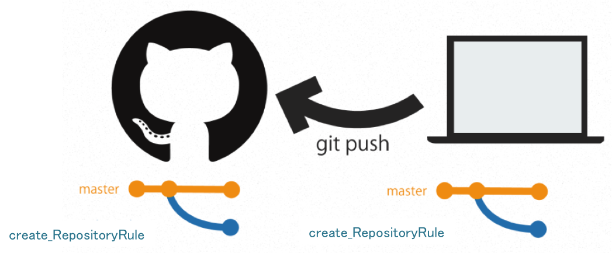

#リポジトリ運用規約
##ディレクトリ構成
```
/ASTMS  
    /app            //CakePHPのアプリケーションディレクトリ
    /document       //書類
    /lib            //CakePHPのコアディレクトリ
```

##ブランチについて
* <span style="color:red">master</span>
	- 出荷可能な状態．常に動く状態にしとく
* <span style="color:green">develop</span>
	- 開発中のコミットが行われる主軸
	- 後述のfeatureはここから派生
	- ここで動くものが完成したらmasterにマージ
* <span style="color:blue">feature/タスク名</span>
	- 各タスクはこのブランチで行う
	- ブランチ名の最後にタスク名を付ける
		- 例：feature/Search_Shop

##Github-flow
* Github-flowを利用して運用します
	- Github-flowについて
		- [Github-flowを分かりやすく図解してみた](http://b.pyar.bz/blog/2014/01/22/github-flow/)
	- Pull Requestの命名規則
		- 英語
		- 文頭大文字  
		例：Fix bug of search

##実際の流れ
「リポジトリ運用規約の追加」のタスクについて実際にどうやるか説明  

* 前提
	- リポジトリをクローン済み
	- developにいる
	- <span style="color:red">developが最新の状態</span>

###1．タスクのブランチを作成
	$ git checkout -b feature/create_RepositoryRule
	

	
###2．タスクが完了するまでコーディング

###3．ローカルで作成したブランチをgithubに反映
```
$ git add -A
$ git commit -m "Create RepositoryRule"
$ git push origin feature/create_RepositoryRule
```

 
 
git add -A を使うときはgitignoreを設定しておこう

###4．pull requestを送信
 

* <span style="color:red">コメントにレビューの期間を書く</span>
	- 例：「2015/10/22までにはレビューしてほしいな」など

###5．みんなでレビュー
 

###6．許可が出たら，developブランチへmarge
<span style="color:red">基本，pull req送信した人がmargeするようにしよう．</span>

###7．ブランチを削除する
####7．1．ローカルブランチ削除
```
$ git checkout develop
$ git branch -D feature/create_RepositoryRule
```

 

####7．2．github上のブランチを削除
```
$ git push origin :feature/create_RepositoryRule
```

 

###8．git pullでdevelopリポジトリを更新する
```
$ git pull origin develop
```

 